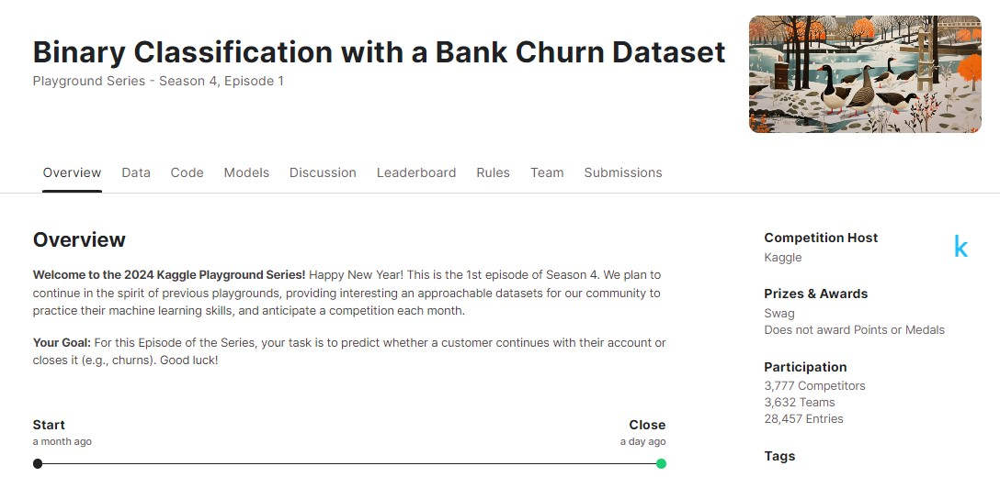
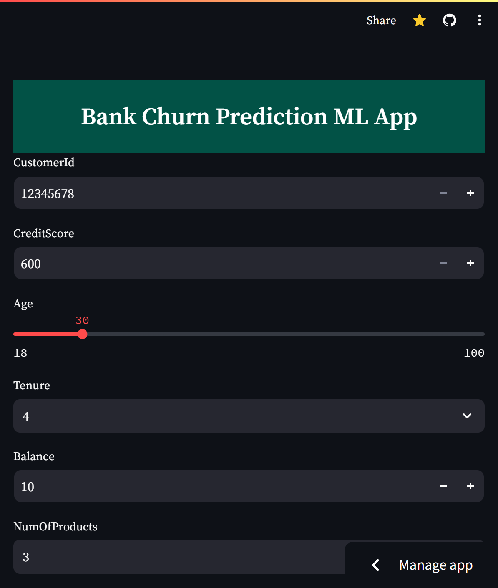
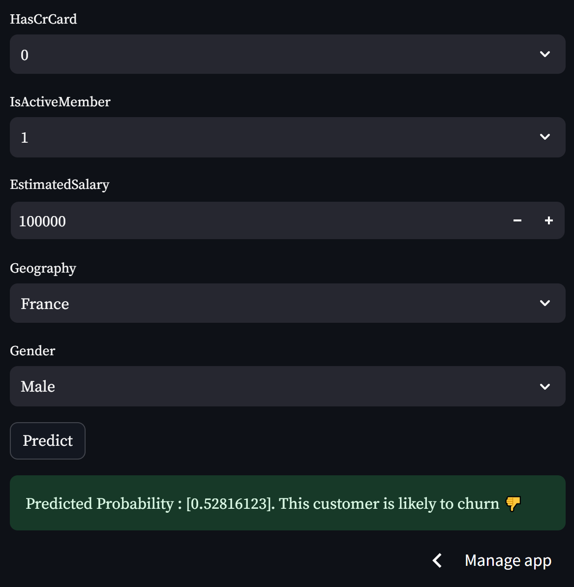
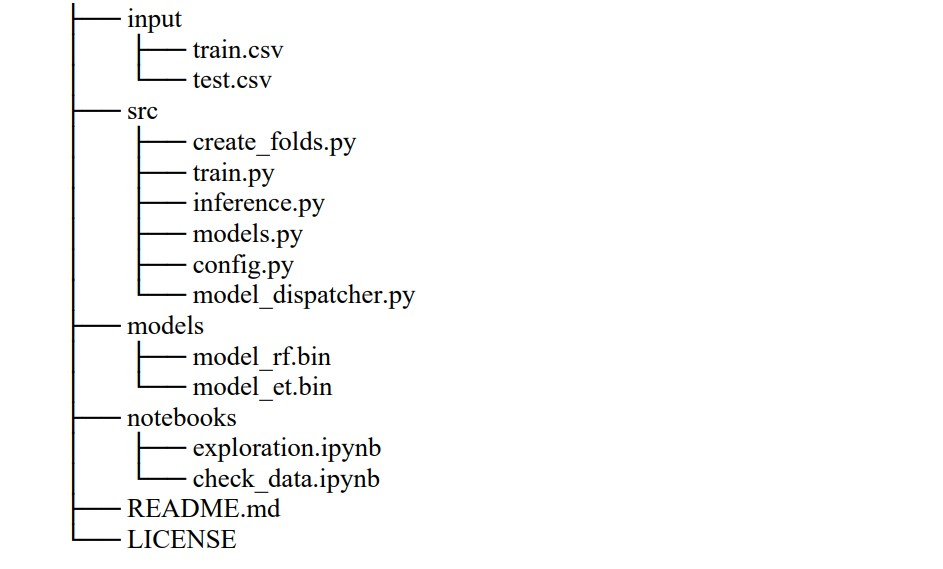

# Bank Churn Prediction ML App

The main goal of this project is **to predict whether a customer continues with their account or closes it (e.g., churns).** 
It is the 1st episode of Kaggle Playground Series - Season 4.

 


- **App Link:** [Bank Churn Prediction ML App](https://anyantudre-binary-classification-with-a-bank-churn-dataset.streamlit.app/)  

- **Evaluation Metric:**
The evaluation metric is **area under the ROC curve** between the predicted probability and the observed target  

- **App Demo Screenshot:**   




## Tech Stack

- **Data Visualization & Manipulation:** matplotlib, seaborn, numpy & pandas.  
- **Model Building:** scikit-learn, xgboost, lightgbm & catboost.   
- **Deployment:** joblib & streamlit.     
- **Versionning & Others:** Git, Github, VSCode, os & argparse.   


## Data sources

 - [Competition Dataset:](https://www.kaggle.com/competitions/playground-series-s4e1/data)
 The dataset for this competition (both train and test) was generated from a deep learning model trained on the Bank Customer Churn Prediction dataset. Feature distributions are close to, but not exactly the same, as the original.


 - [Original Dataset:](https://www.kaggle.com/datasets/shubhammeshram579/bank-customer-churn-prediction)
 The bank customer churn dataset is a commonly used dataset for predicting customer churn in the banking industry. It contains information on bank customers who either left the bank or continue to be a customer. The dataset includes the following attributes:

| Column name             | Description                                                                |
| ----------------- | ------------------------------------------------------------------ |
| Customer ID | A unique identifier for each customer |
| Surname | The customer's surname or last name |
| Credit Score | A numerical value representing the customer's credit score |
| Geography | The country where the customer resides (France, Spain or Germany) |
| Gender | The customer's gender (Male or Female) |
| Age | The customer's age |
| Tenure | The number of years the customer has been with the bank |
| Balance | The customer's account balance |
| NumOfProducts | The number of bank products the customer uses (e.g., savings account, credit card) |
| HasCrCard | Whether the customer has a credit card (1 = yes, 0 = no) |
| IsActiveMember | Whether the customer is an active member (1 = yes, 0 = no) |
| EstimatedSalary | The estimated salary of the customer |
| Exited | Whether the customer has churned (1 = yes, 0 = no) |

## Code Structure

- **Screenshot:**  



- **Description:**

| folders             | Description                                                                |
| ----------------- | ------------------------------------------------------------------ |
| input/ | consists of all the input files and data for the project (train, test, original, sample_submission) |
| media/ | only contains images for the README.md file |
| models/ | keeps all the trained models saved with joblib. |
| notebooks/ | all jupyter notebooks (i.e. any *.ipynb file) are stored in the notebooks folder |
| output/ | contains all the models predictions(i.e submissions to the competition) |
| src/ | contains all the python scripts(i.e. any *.py file) as well as a bash script (i.e. run.sh file) to automate model training process |
| README.md | markdown file where I described the project. It's what you're reading right now |
| app.py | python file for streamlit deployement |
| requirements.txt | contains all the packages neede by the project to run and their versions|


## Results and evaluation


- **My Approach:** Firstly I setted up a local 5 fold cross validation using the create_folds.py file. 
Then, I tried five tree-based models (eg. xgboost, lightgbm, catboost, gbm and histgbm) and then I ensemble the predictions on a weigthwed averave.
I tried different Feature Engineering methods but looked like they didn't improve too much the score. 
As I didn't have too much time for this competition I only tuned some hyperparameters of the histgbm model using RandomizedSearchCV.   

What's more, it seems that the winner actually used only CatBoost, and I'm happy about that (I can even brag about it) 
because I was probably the first to publish a public notebook on Catboost baseline at the beginning of the competition. 


- Here is the link to my first notebook about Catboost baselise[[PS4-EP1] Bank Churn | EDA📊 + CatBoost baseline🦾](https://www.kaggle.com/code/waalbannyantudre/ps4-ep1-bank-churn-eda-catboost-baseline)
I also added it to the notebooks/ folder.


- **[First place solution wrappup:](https://www.kaggle.com/competitions/playground-series-s4e1/discussion/472502)**
  1. It was important to recognize that CustomerId and Surname are high-cardinality categorical variables and encode them correctly.
  2. Catboost was enough to win this competition. My final submission was based on one Catboost model averaged across 20 folds.
  3. If you tuned Catboost parameters well you would be in Top 3. There're a lot of parameters to tune and there are many ways to encode categorical features. I now realize that my 1st place solution can be improved even further.


- **My Kaggle Leaderboard results:**
    - Public  LB AUC score : 0.88666
    - Private LB AUC score : 0.88938
    - LB rank : Although I didn't commit 100% to this competition, I finished 1101 out of 3633 participants (Top 30%). I'm sure I'll do better in future Playgroud series :)


## How to Run this Project Locally?

1. First fork the repo to your GitHub account

2. Clone the project

```bash
  git clone https://github.com/ANYANTUDRE/Binary-Classification-with-a-Bank-Churn-Dataset
```

3. Go to the project directory

```bash
  cd Binary-Classification-with-a-Bank-Churn-Dataset
```

4. Install dependencies

```bash
  pip intall requirements.txt
```

5. Start the server

```bash
  streamlit run app.py
```


## Contributing

All kind of contributions are always welcome!


## Authors

- [@anyantudre](https://github.com/ANYANTUDRE)


## License

- **Competition Dataset:**  
@misc{playground-series-s4e1,  
    author = {Walter Reade, Ashley Chow},  
    title = {Binary Classification with a Bank Churn Dataset },  
    publisher = {Kaggle},  
    year = {2024},  
    url = {https://kaggle.com/competitions/playground-series-s4e1}  
}

